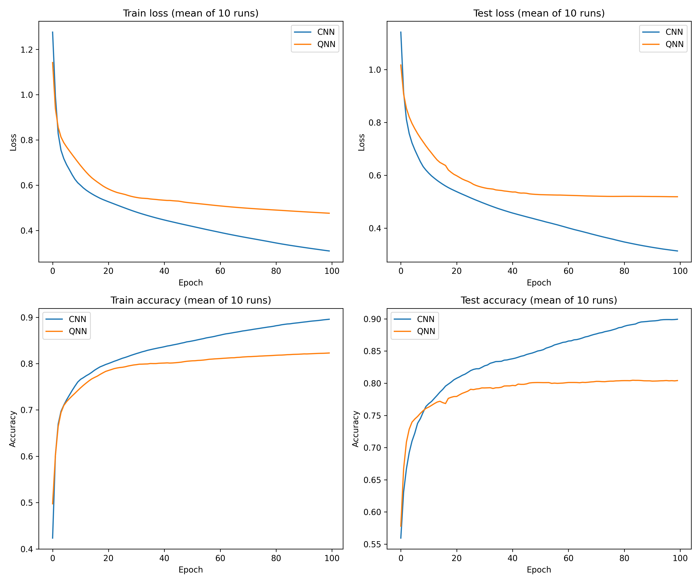

# DeepSat4 QNN

Here we implement the quanvolutional neural network described in the paper [Methods for accelerating geospatial data processing using quantum computers](https://link.springer.com/article/10.1007/s42484-020-00034-6) by Henderson, Gallina, and Brett and train it on the [DeepSat4](https://csc.lsu.edu/~saikat/deepsat/) dataset.  Due to limited availability of computing power, only 320,208 out of the total 5,184,000 inputs in the training dataset were processed by the quanvolutional layer. For any unprocessed inputs, we perform a nearest neighbours search on the processed inputs to obtain a prediction of the expectation value of the quantum filter on the unprocessed input.

We obtain the following results for the quantum and classical models over 100 epochs with a batch size of 128 and learning rate of 0.001.

